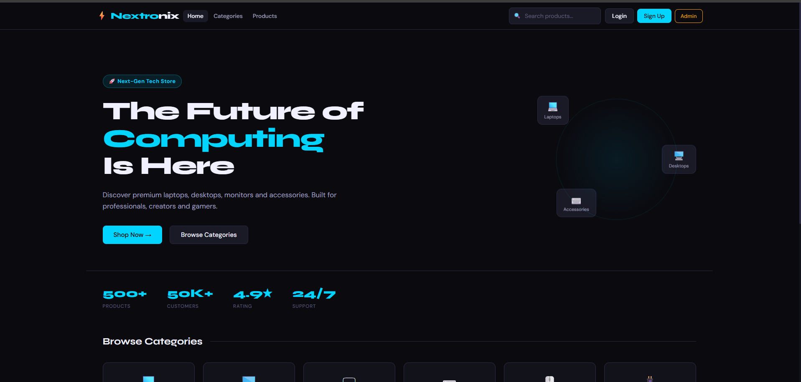
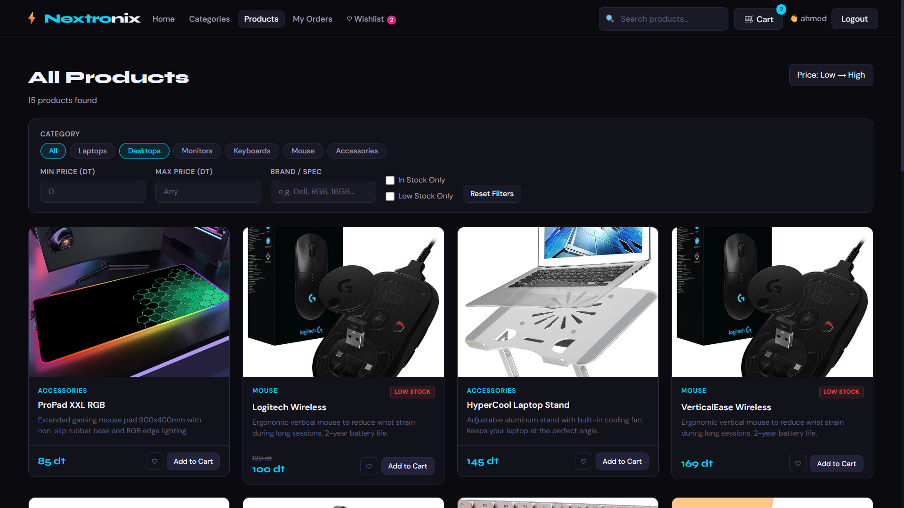
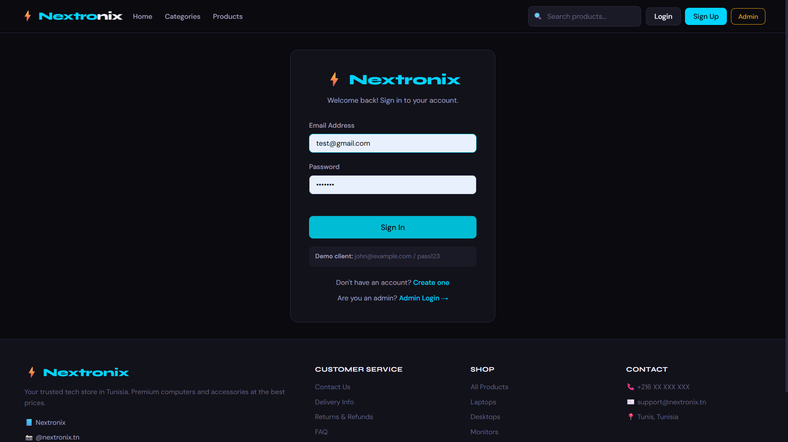

# Nextronix – The Future of Computing

A modern e-commerce platform for electronics built as a university project. Nextronix showcases a full-stack web application with user authentication, product management, shopping cart functionality, and order processing.


---

## 🎯 Features

- **User Authentication**
  - Client registration and login with secure password hashing
  - Admin login for platform management
  - Role-based access control (Client vs Admin)

- **Product Catalog**
  - Browse products across 6 categories: Laptops, Desktops, Monitors, Keyboards, Mouse, and Accessories
  - Detailed product pages with specifications, pricing, and stock information
  - Sale badges and new product highlights
  - Advanced search functionality

- **Shopping Cart**
  - Add/remove products from cart
  - Persistent cart storage using browser localStorage
  - Real-time cart updates and badge notifications
  - Delivery fee calculation with free shipping threshold (over 500 currency units)

- **Wishlist**
  - Save favorite products for later
  - Quick-view wishlist from navbar

- **Order Management**
  - Place orders from cart
  - View order history and status
  - Track order progress (Pending → Processing → Shipped → Delivered)

- **Admin Panel**
  - Manage product inventory
  - View and track all orders
  - User account management

---

## 🛠️ Tech Stack

**Frontend:**

- HTML
- CSS3
- JavaScript (vanilla, no frameworks)
- LocalStorage API (client-side cart persistence)

**Backend:**

- PHP 
- MySQL
- RESTful API endpoints

**Development & Deployment:**

- Git/GitHub version control
- XAMPP/WAMP (local development)

---

## 📁 Project Structure

```
nextronix-v3/e-commerce-uni-project/
│
├── index.html              # Main application shell
├── app.js                  # Frontend logic, UI rendering, API calls
├── style.css               # Global styling and responsive design
│
├── backend/                # PHP backend and database
│   ├── config.php          # Database connection settings
│   ├── db.php              # Database helper functions
│   ├── schema.sql          # Database schema and tables
│   ├── seed_products.php   # Product seeding script
│   ├── test_db.php         # Database testing utility
│   ├── health.php          # API health check endpoint
│   ├── auth.php            # User authentication (login/register)
│   ├── products.php        # Product listing and retrieval
│   ├── orders.php          # Order creation and management
│   ├── users.php           # User account management
│   └── README.md           # Backend setup instructions
│
├── conception/             # Project design and UML diagrams
│   ├── use case.mdj        # Use case diagrams
│   ├── classes.mdj         # Class diagrams
│   ├── login.mdj           # Login flow diagram
│   ├── admin.mdj           # Admin panel diagram
│   ├── achat.mdj           # Purchase flow diagram
│   └── cas d'utilisation.mdj  # French use case documentation
│
├── screenshots/            # Application screenshots (for documentation)
│   ├── home.png            # Homepage with hero section and categories
│   ├── products.png        # Product listing and search results
│   ├── login.png           # Login and registration pages
│   └── orders.png          # Order history and order details
│
└── .git/                   # Git version control
```

---

## 📸 Screenshots

### Homepage



### Product Listing



### Login & Registration



### Order Management


---

## 🗄️ Database

The application uses MySQL with a normalized schema supporting:

**Users Table**

- Stores client and admin accounts
- Secure password hashing (never stored in plain text)
- Role-based access control

**Products Table**

- Complete product catalog with pricing and stock management
- JSON field for detailed specifications
- Support for sale badges and new product highlights

**Orders & Order Items Tables**

- Customer order history with status tracking
- Snapshots of pricing at purchase time (old prices don't affect past receipts)
- Proper foreign key relationships for data integrity

See `backend/schema.sql` for the complete database schema.

---

## 🚀 How to Run Locally

### Prerequisites

- **XAMPP** or **WAMP** installed (for Apache and MySQL)
- **PHP 7.4+** with MySQLi extension enabled
- **Git** for version control

### Setup Steps

1. **Clone the repository:**

   ```bash
   git clone https://github.com/yourusername/nextronix-v3.git
   cd e-commerce-uni-project
   ```

2. **Start your local server:**
   - Open XAMPP/WAMP Control Panel
   - Start **Apache** and **MySQL** modules

3. **Create the database:**
   - Open phpMyAdmin: `http://localhost/phpmyadmin`
   - Create a new database named `nextronix`
   - Import `backend/schema.sql` to create tables

4. **Update database credentials:**
   - Edit `backend/config.php` if needed (default: root user, no password)

5. **Start the PHP development server:**

   ```bash
   cd /path/to/project
   php -S localhost:8000
   ```

6. **Open in browser:**
   - Navigate to `http://localhost:8000`

7. **Verify backend connection:**
   - Check `http://localhost:8000/backend/health.php`
   - Should return: `{"ok": true, "message": "Backend connected to MySQL."}`

### Test Accounts

- **Admin Login:** (check your database or create via registration with admin role)
- **Client Account:** Register a new account from the Sign Up page

---

## 📚 What I Learned

Building Nextronix as a second-year computer science student provided valuable hands-on experience with:

- **Full-Stack Development:** Understanding how frontend and backend communicate through REST APIs
- **Database Design:** Normalizing data structures, defining relationships, and writing efficient SQL queries
- **User Authentication:** Implementing secure login systems with password hashing (though in production, frameworks like Bcrypt would be used)
- **Frontend JavaScript:** DOM manipulation, event handling, localStorage for client-side persistence, and AJAX API calls
- **PHP Backend:** Server-side validation, request handling, and database queries
- **Version Control:** Using Git for project management and collaboration
- **Project Planning:** Designing the application with UML diagrams before implementation
- **Testing & Debugging:** Identifying issues and ensuring components work together correctly

---

## 🔮 Future Improvements

- **Payment Integration:** Add Stripe or PayPal for real transaction processing
- **Product Reviews & Ratings:** Allow customers to rate and review products
- **Email Notifications:** Send order confirmation and status update emails
- **Advanced Search & Filters:** Price range, brand, specifications, and availability filters
- **Inventory Management:** Real-time stock alerts and low-stock notifications
- **Admin Dashboard:** Analytics and sales reports for store management
- **User Dashboard:** Wishlist management, saved addresses, and preference settings
- **Security Enhancements:**
  - Implement password reset functionality
  - Add CSRF token protection
  - Use prepared statements for all queries
  - Implement rate limiting on authentication endpoints
- **Performance Optimization:**
  - Image optimization and lazy loading
  - Database query optimization and indexing
  - Caching strategies for product listings
- **Mobile-First Redesign:** Enhance responsive design for better mobile experience
- **Accessibility:** ARIA labels, keyboard navigation, and screen reader support
- **Product Recommendations:** AI-based suggestions based on browsing and purchase history

---

## 📋 License

This project is created for educational purposes.

---

## 👨‍💻 Author

Built as a university e-commerce project demonstrating full-stack web development skills.

---

**Questions or feedback?** Feel free to reach out or open an issue on GitHub!
